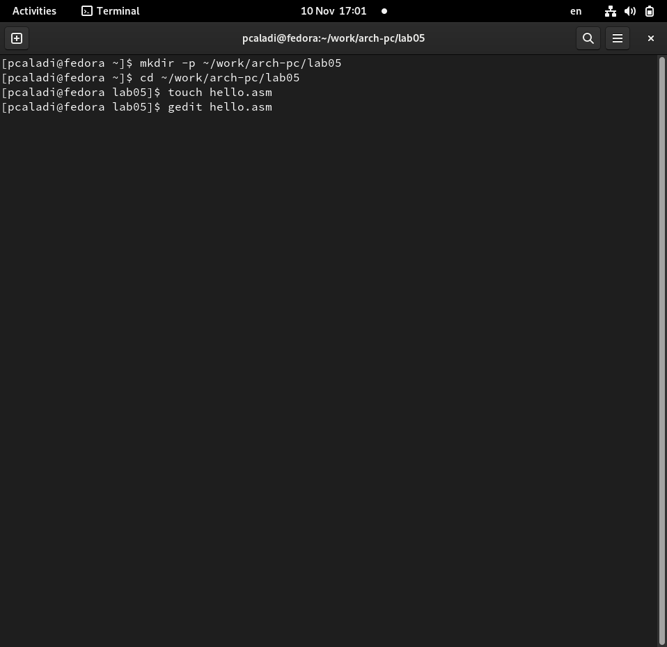
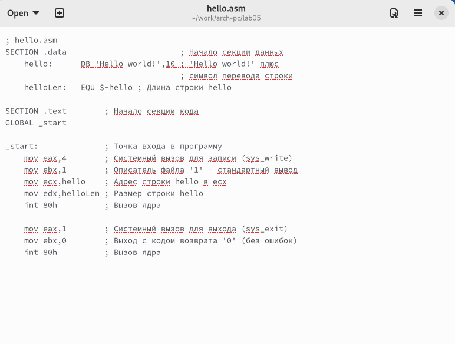
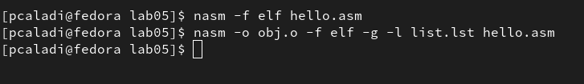
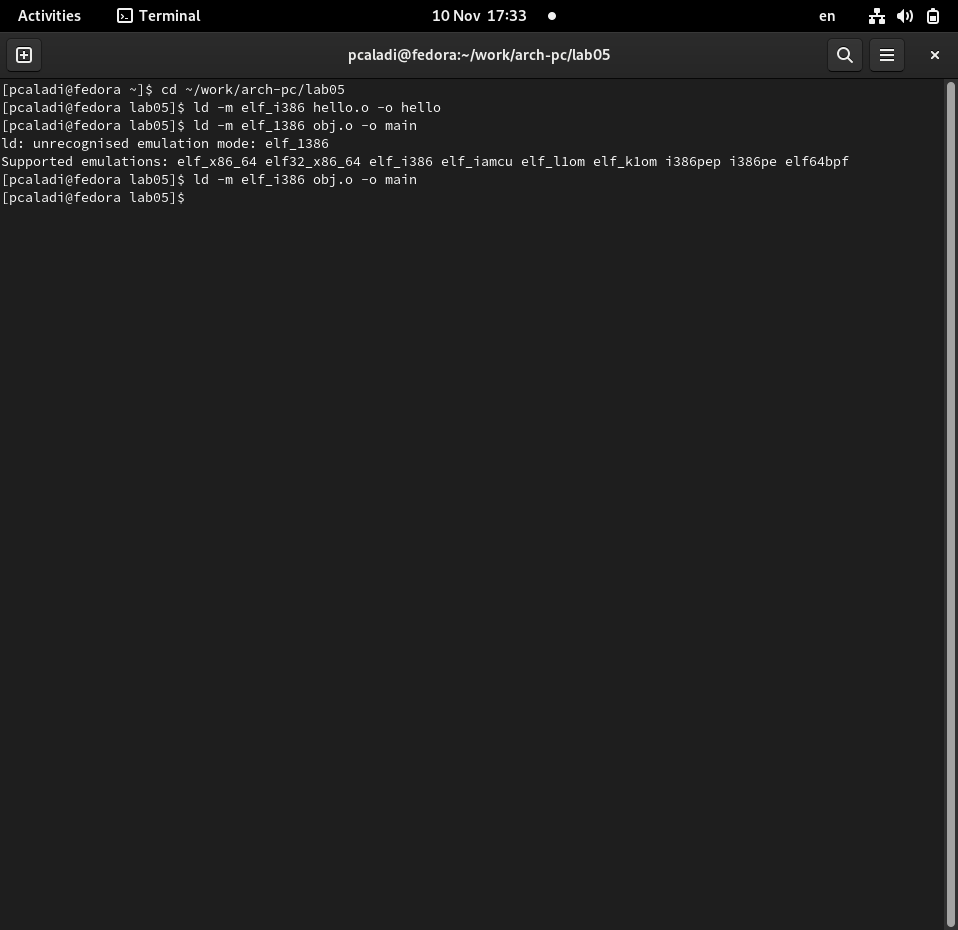
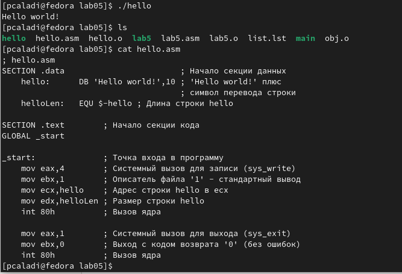
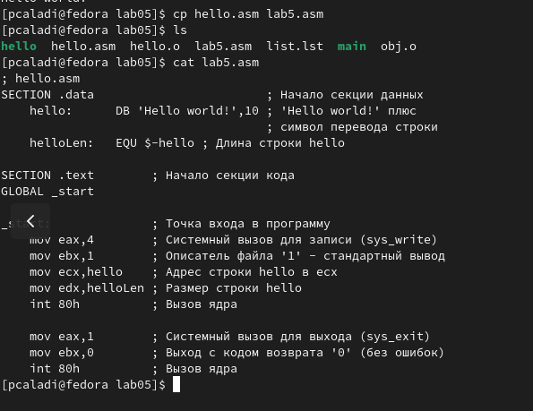
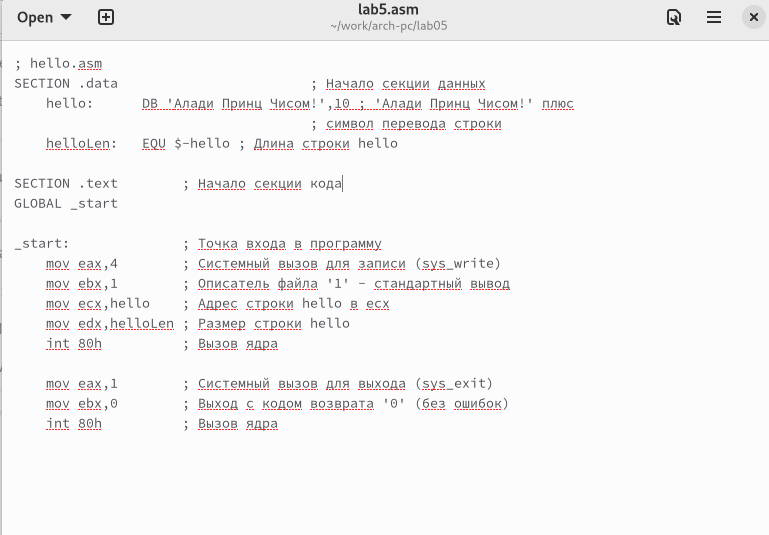
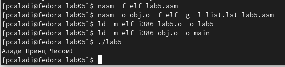
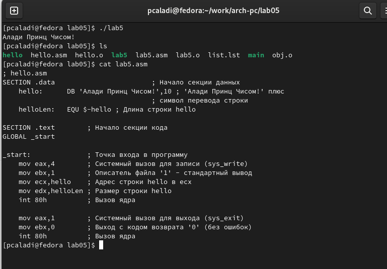
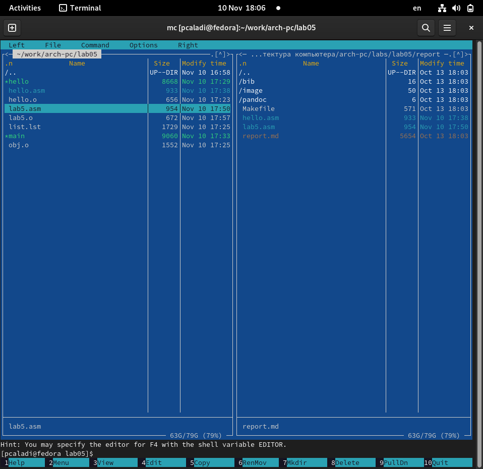

---
## Front matter
title: "Шаблон отчёта по лабораторной работе"
subtitle: "Простейший вариант"
author: "Алади Принц Чисом; НКАБД-05-22"

## Generic otions
lang: ru-RU
toc-title: "Содержание"

## Bibliography
bibliography: bib/cite.bib
csl: pandoc/csl/gost-r-7-0-5-2008-numeric.csl

## Pdf output format
toc: true # Table of contents
toc-depth: 2
lof: true # List of figures
lot: true # List of tables
fontsize: 12pt
linestretch: 1.5
papersize: a4
documentclass: scrreprt
## I18n polyglossia
polyglossia-lang:
  name: russian
  options:
	- spelling=modern
	- babelshorthands=true
polyglossia-otherlangs:
  name: english
## I18n babel
babel-lang: russian
babel-otherlangs: english
## Fonts
mainfont: PT Serif
romanfont: PT Serif
sansfont: PT Sans
monofont: PT Mono
mainfontoptions: Ligatures=TeX
romanfontoptions: Ligatures=TeX
sansfontoptions: Ligatures=TeX,Scale=MatchLowercase
monofontoptions: Scale=MatchLowercase,Scale=0.9
## Biblatex
biblatex: true
biblio-style: "gost-numeric"
biblatexoptions:
  - parentracker=true
  - backend=biber
  - hyperref=auto
  - language=auto
  - autolang=other*
  - citestyle=gost-numeric
## Pandoc-crossref LaTeX customization
figureTitle: "Рис."
tableTitle: "Таблица"
listingTitle: "Листинг"
lofTitle: "Список иллюстраций"
lotTitle: "Список таблиц"
lolTitle: "Листинги"
## Misc options
indent: true
header-includes:
  - \usepackage{indentfirst}
  - \usepackage{float} # keep figures where there are in the text
  - \floatplacement{figure}{H} # keep figures where there are in the text
---

# Цель работы

Освоение процедуры компиляции и сборки программ, написанных на ассем-
блере NASM.

# Задание

1. Программа Hello world!

2. Транслятор NASM, Расширенный ситаксис командой строки NASM и Компоновщик LD.

3. Запуск исполняемого файла

4. Заданние для самостоятельной работы
1. В каталоге ~/work/arch-pc/lab05 с помощью команды cp создайте копию файла hello.asm с именем lab5.asm
2. С помощью любого текстового редактора внесите изменения в текст про-граммы в файле lab5.asm так, чтобы вместо Hello world! на экран выводилась строка с вашими фамилией и именем.
3. Оттранслируйте полученный текст программы lab5.asm в объектный файл. Выполните компоновку объектного файла и запустите получившийся исполняемый файл.
4. Скопируйте файлы hello.asm и lab5.asm в Ваш локальный репозиторий в каталог ~/work/study/2022-2023/"Архитектура компьютера"/arch-pc/labs/lab05/. Загрузите файлы на Github.

# Теоретическое введение

Основными функциональными элементами любой электронно-вычислительной машины (ЭВМ) являются центральный процессор, память и периферийные устройства.
Взаимодействие этих устройств осуществляется через общую шину, к которой они подключены. Физически шина представляет собой большое количество проводников, соединяющих устройства друг с другом. В современных компьютерах проводники выполнены в виде электропроводящих дорожек на материнской (системной) плате.

Основной задачей процессора является обработка информации, а также организация координации всех узлов компьютера. В состав центрального процессора (ЦП) входят следующие устройства:
• арифметико-логическое устройство (АЛУ) — выполняет логические и арифметические действия, необходимые для обработки информации,хранящейся в памяти;
• устройство управления (УУ) — обеспечивает управление и контроль всех устройств компьютера;
• регистры — сверхбыстрая оперативная память небольшого объёма, входящая в состав процессора, для временного хранения промежуточных результатов выполнения инструкций; регистры процессора делятся на два
типа: регистры общего назначения и специальные регистры.

# Выполнение лабораторной работы

1. Программа Hello world!
Я создал каталог для работы с программами на ассемблере NASM и открыл файл в текстовом    редакторе. После этого я ввел текст, показанный в описании изображения ниже.
(рис.[-@fig:001;-@fig:002])

#fig:001 width=70%}

#fig:002 width=70%}

2. Транслятор NASM, Расширенный ситаксис командой строки NASM и Компоновщик LD.
Я скомпилировал программу «Hello World», используя NASM, расширенный синтаксис командной строки NASM и компоновщик LD, как показано на рисунке ниже.
(рис.[-@fig:003;-@fig:004])

#fig:003 width=70%}

#fig:004 width=70%}

3. Запуск исполняемого файла
Я выполнил сгенерированный исполняемый файл, расположенный в каталоге. (рис.[-@fig:005])

#fig:005 width=70%}

4. Заданние для самостоятельной работы

1. В каталоге ~/work/arch-pc/lab05 я использовал команду cp для создания файла hello.asm с именем lab5.asm.(рис.[-@fig:006])

#fig:006 width=70%}

2. С помощью текстового редактора я отредактировал текст программы в файле lab5.asm, чтобы вместо Hello world! на экране отображалась строка моего имени и фамилии.(рис.[-@fig:007])

#fig:007 width=70%}

3. Я перевел получившийся текст программы lab5.asm в объектный файл. Связал объект и запустил полученный исполняемый файл.(рис.[-@fig:008;-@fig:009])

#fig:008 width=70%}

#fig:009 width=70%}

4. Я скопировал файлы hello.asm и lab5.asm в свой локальный репозиторий, а также загрузил файлы на github.(рис.[-@fig:010]

#fig:010 width=70%}

# Выводы

В ходе этой лабораторной работы я приобрел практические навыки освоения процедур компиляции и ассемблера программ, написанных на ассемблере NASM.

# Список литературы{.unnumbered}

::: {#refs}
:::
