---
## Front matter
title: "Шаблон отчёта по лабораторной работе"
subtitle: "Простейший вариант"
author: "Алади Принц Чисом; НКАБД-05-22"

## Generic otions
lang: ru-RU
toc-title: "Содержание"

## Bibliography
bibliography: bib/cite.bib
csl: pandoc/csl/gost-r-7-0-5-2008-numeric.csl

## Pdf output format
toc: true # Table of contents
toc-depth: 2
lof: true # List of figures
lot: true # List of tables
fontsize: 12pt
linestretch: 1.5
papersize: a4
documentclass: scrreprt
## I18n polyglossia
polyglossia-lang:
  name: russian
  options:
	- spelling=modern
	- babelshorthands=true
polyglossia-otherlangs:
  name: english
## I18n babel
babel-lang: russian
babel-otherlangs: english
## Fonts
mainfont: PT Serif
romanfont: PT Serif
sansfont: PT Sans
monofont: PT Mono
mainfontoptions: Ligatures=TeX
romanfontoptions: Ligatures=TeX
sansfontoptions: Ligatures=TeX,Scale=MatchLowercase
monofontoptions: Scale=MatchLowercase,Scale=0.9
## Biblatex
biblatex: true
biblio-style: "gost-numeric"
biblatexoptions:
  - parentracker=true
  - backend=biber
  - hyperref=auto
  - language=auto
  - autolang=other*
  - citestyle=gost-numeric
## Pandoc-crossref LaTeX customization
figureTitle: "Рис."
tableTitle: "Таблица"
listingTitle: "Листинг"
lofTitle: "Список иллюстраций"
lotTitle: "Список таблиц"
lolTitle: "Листинги"
## Misc options
indent: true
header-includes:
  - \usepackage{indentfirst}
  - \usepackage{float} # keep figures where there are in the text
  - \floatplacement{figure}{H} # keep figures where there are in the text
---

# Цель работы
Приобретение практических навыков работы в Midnight Commander. Освоение
инструкций языка ассемблера mov и int.

# Теоретическое введение

Midnight Commander (или просто mc) — это программа, которая позволяет
просматривать структуру каталогов и выполнять основные операции по управ-
лению файловой системой, т.е. mc является файловым менеджером. Midnight
Commander позволяет сделать работу с файлами более удобной и наглядной.
Для активации оболочки Midnight Commander достаточно ввести в командной
строке mc и нажать клавишу Enter

# Выполнение лабораторной работы

1. Откроем Midnight commander с помощью команды. (рис. [-@fig:001])

   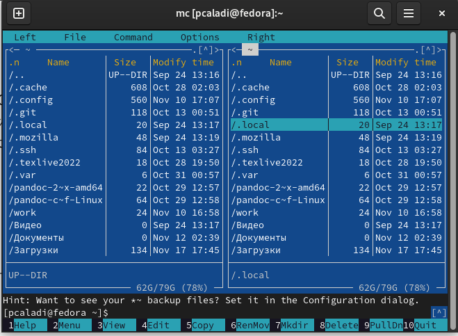{ #fig:001 width=70% }

2. Перехожу в каталоя ~/work/arch-pc созданный при выполнении лабораторной работы №5. 
   (рис.[-@fig:002])
   
   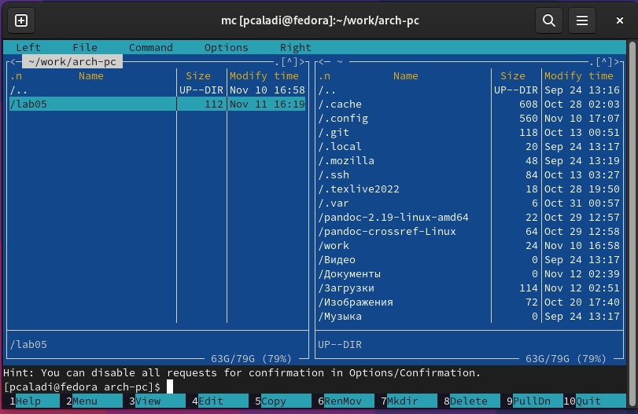{ #fig:002 width=70% }
   
3. С помощью функциональной клавиши F7 создайте папку lab06
   и перехожу в созданный каталог. (рис. [-@fig:003])
   
   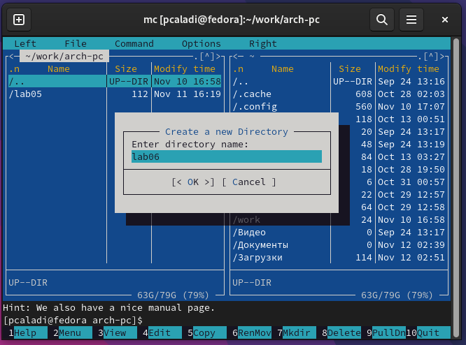{ #fig:003 width=70% }
   
4. Пользуясь строкой ввода и командой touch создайте файл lab6-1.asm. (рис. [-@fig:004])

   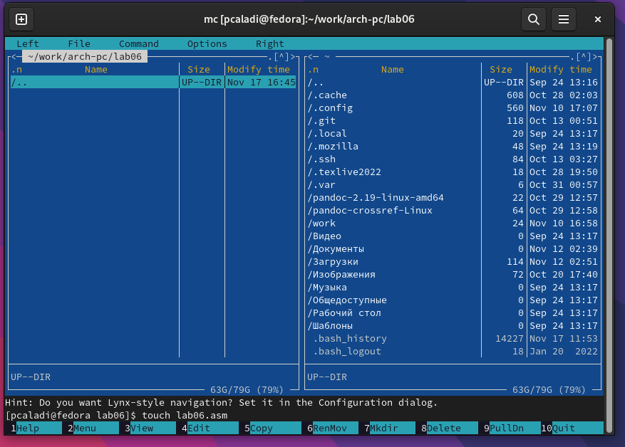{ #fig:004 width=70% }
   
5. С помощью функциональной клавиши F4 откройте файл lab6-1.asm для редактирования 
   во встроенном редактора Midnight Commander. (рис. [-@fig:005])
   
   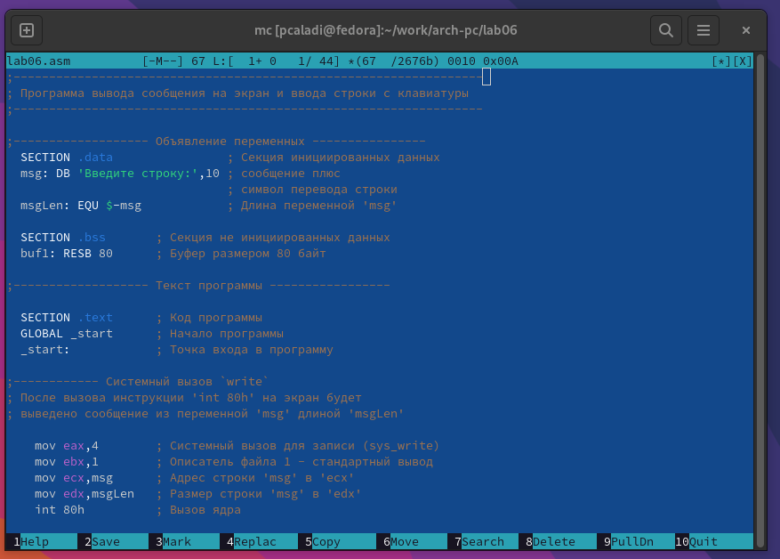{ #fig:005 width=70% }
   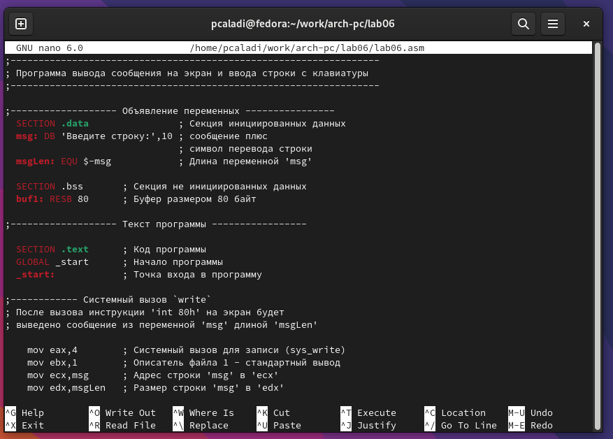{ #fig:005 width=70% }
   
6. С помощыо функчиональной клавиши F3 открываю файл lab6-1.asm для просмотра.Убеждаюсь,      
   что файл содержить текст программы. (рис. [-@fig:006])
   
   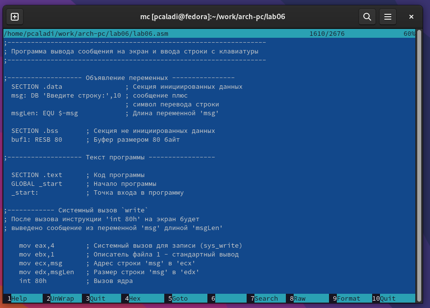{ #fig:006 width=70% }
   
7. Оттранслируйте текст программы lab6-1.asm в объектный файл. Выполните компоновку   
   объектного файла и запустите получившийся исполняемый файл. Программа выводит строку    
   'Введите строку:' и ожидает ввода с клавиатуры.(рис. [-@fig:007])
   
   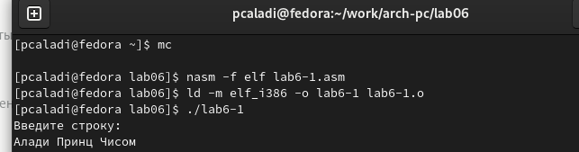{ #fig:007 width=70% }
   
8. Я скачал файл in_out.asm со страницы курса туис

9. Подключаемый файл in_out.asm должен лежать в том же каталоге, что и файл с программой, 
   в которой он используется. В одной из панелей mc откройте каталог с файлом lab6-1.asm. 
   В другой панели каталог со скаченным файлом in_out.asm (для перемещения между панелями
   используйте Tab ). Скопируйте файл in_out.asm в каталог с файлом lab6-1.asm с помощью  
   функциональной клавиши F5.(рис. [-@fig:008])
   
   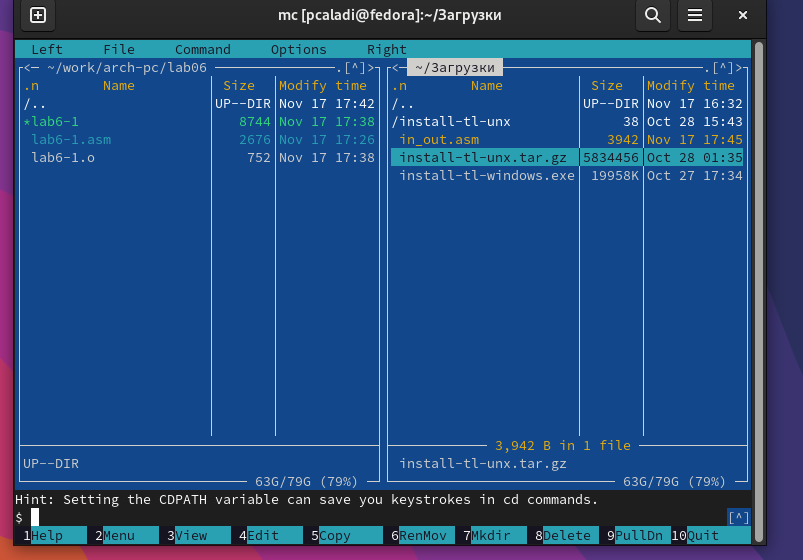{ #fig:008 width=70% }
   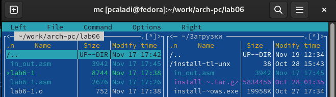{ #fig:009 width=70% }
   
10. С помощью функциональной клавиши F6 создайте копию файла lab6-1.asm с именем lab6-2.asm. 
    Выделите файл lab6-1.asm, нажмите клавишу F6 , введите имя файла lab6-2.asm и нажмите  
    клавишу Enter  (рис. [-@fig:009])
    
    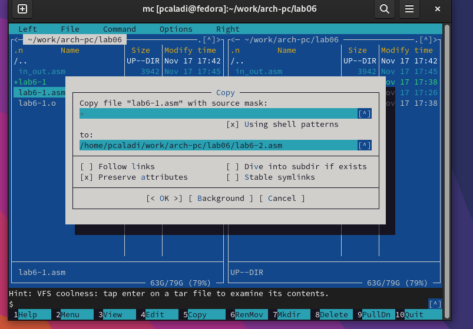{ #fig:010 width=70% }
    
11. Исправляю тектс программы в файле la6-2.asm с использование подпрограми из внешнего 
    файла in_out.asm в соотвествии с листингом 6.2) (рис 2.11) создаю исполняемый файл и 
    проверяю его работу) (рис.2.12)(рис. [-@fig:011])

    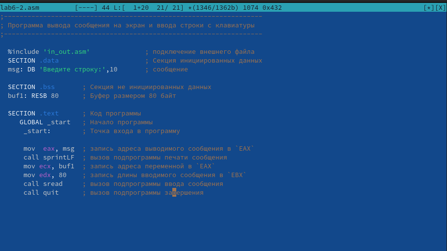{ #fig:011  width=70% }
    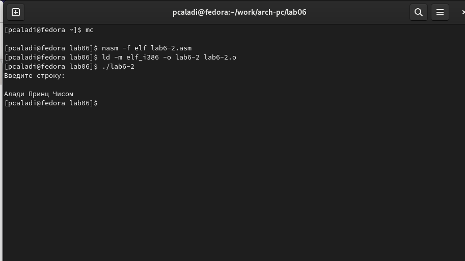{ #fig:012 width=70% }
          
12. В файле lab6-2.asm замените подпрограмму sprintLF на sprint. Создайте исполняемый файл и 
    проверьте его работу (рис. [-@fig:012]
   
   { #fig:012 width=70% }
    { #fig:013 width=70% }
   
   
# Задание для самостоятельной работы 

1. Создайте копию файла lab6-1.asm. Внесите изменения в программу (без использования внешнего 
   файла in_out.asm) (рис. [-@fig:014])
   
   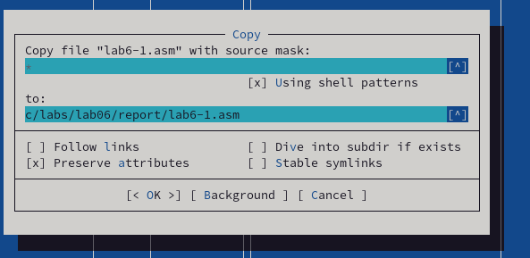{ #fig:014 width=70% }
   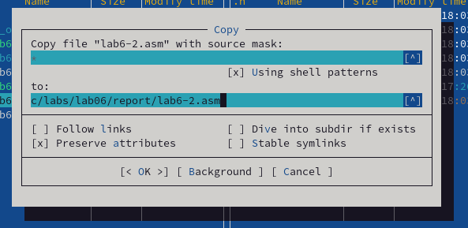{ #fig:015 width=70% }
   
   

# Выводы

Приобрел практические навыки работы в Midnight Commader и освоил инструкции языка ассемблера mov и int.

# Список литературы{.unnumbered}

::: {#refs}
:::
